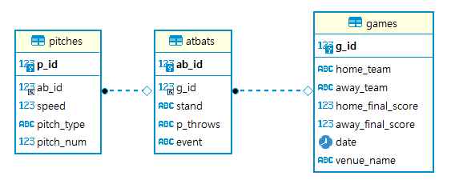

# 야구 데이터를 활용한 SQL
Kaggle에서 MLB 경기, 타석, 투구 정보를 담고 있는 CSV파일 데이터를 활용하여, 데이터를 모델링하고 간단한 데이터 분석을 실시하였다.
## Data description
`games_staging`  
- g_id: 경기 고유 번호
- home_team: 홈팀 명
- away_team: 원정팀 명
- home_final_score: 홈팀 득점
- away_final_score: 원정팀 득점
- date: 경기 날짜
- venue_name: 경기장 명

`atbats_staging`
- inning: 이닝
- top: 초 or 말
- ab_id: 타석 고유 번호
- batter_id: 타자 고유 번호
- pitcher_id: 투수 고유 번호
- stand: 좌/우 타석(타자)
- p_throws: 좌/우투(투수)
- event: 타석 결과
- o: 아웃카운트

`pitches_staging`
- start_speed: 초속
- end_speed: 종속
- b_count: 볼 카운트
- s_count: 스트라이크 카운트
- outs: 아웃카운트
- pitch_num: 타석 당 투구 수

## Data modeling
각 Staging 테이블에서 필요한 컬럼만을 뽑아서 테이블을 새롭게 생성한 후, 데이터를 로딩을 실시하였다.
- `games`
```sql
create table games (
	g_id int not null primary key,
	home_team varchar(255),
	away_team varchar(255),
	home_final_score int,
	away_final_score int,
	venue_name varchar(255)
)
```
```sql
insert into games (g_id, home_team, away_team, home_final_score, away_final_score, venue_name)
select g_id, home_team, away_team, home_final_score, away_final_score, venue_name
from games_staging
```
- `atbats`
```sql
create table atbats (
	ab_id int not null primary key,
	g_id int,
	stand varchar(10),
	p_throws varchar(10),
	event varchar(255),
	foreign key (g_id) references games (g_id)
)
```
```sql
insert into atbats (ab_id, g_id, stand, p_throws, event)
select ab_id, g_id, stand, p_throws, event
from atbats_staging
```
- `pitches`
```sql
create table pitches (
	p_id int not null auto_increment primary key,
	ab_id int,
	speed float,
	pitch_type varchar(10),
	pitch_num int,
	foreign key (ab_id) references atbats (ab_id)
)
```
```sql
insert into pitches (ab_id, speed, pitch_type, pitch_num)
select ab_id, start_speed, pitch_type, pitch_num
from pitches_staging
```
- **ERD diagram**
<center>
  
</center>
